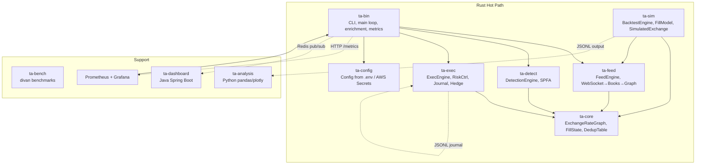

# Triangular Arbitrage Bot

Low-latency triangular arbitrage detection and execution system for cryptocurrency exchanges. Uses SPFA-based negative-cycle detection on a log-weighted exchange-rate graph to find and execute profitable triangles across three trading pairs.

## Architecture



**Data flow (live mode):**

```mermaid
flowchart LR
    WS[Exchange WebSocket] --> FE[ta-feed::FeedEngine.poll]
    FE --> BS[BookSnapshot<br/>FxHashMap]
    FE --> GR[ExchangeRateGraph<br/>log-weighted, price-scaled]
    GR --> DE[ta-detect::DetectionEngine.detect]
    DE --> SPFA[SPFA negative-cycle]
    SPFA --> FILTER[min_profit_bps + fee filter]
    FILTER --> TRI[Triangle + RouteLeg construction]
    TRI --> ENRICH[enrich_opportunity<br/>price/size from top-of-book]
    ENRICH --> EXEC[ta-exec::ExecEngine.execute_opportunity]
    EXEC --> DEDUP[dedup check]
    DEDUP --> RISK[risk check]
    RISK --> PRICE[price check]
    PRICE --> SUBMIT[leg-by-leg Market/IoC submission]
    SUBMIT --> ROLLBACK[partial-fill rollback / hedge]
    ROLLBACK --> JOURNAL[append-only JSONL journal]
```



## Quick Start

```bash
# Build all crates
cargo build --release -p ta-bin

# Run tests across the workspace
cargo test --workspace

# Run benchmarks
cargo bench -p ta-bench
```

### Live Mode

```bash
# Read-only (no API keys — detection + metrics, no execution)
cargo run --release -p ta-bin -- --config production.toml

# With exchange credentials (use read-only keys for market data)
cargo run --release -p ta-bin -- --config production.toml --env-file .env

# AWS Secrets Manager
cargo run --release -p ta-bin --features aws -- --config production.toml --aws-secret ta-bot/prod

# Custom metrics port
cargo run --release -p ta-bin -- --config production.toml --metrics-port 9101
```

### Backtest Mode

```bash
# Run backtest with example config
cargo run --release -p ta-bin -- backtest \
  --config backtest.toml \
  --data data/tick_data.jsonl \
  --output results.jsonl
```

## Crate Descriptions

### ta-core

Foundation types shared across all crates.

- **`ExchangeRateGraph`** — adjacency-matrix exchange-rate graph. Log-weighted: `weight(base→quote) = -ln(bid)`, `weight(quote→base) = ln(ask)`. `detect()` runs Shortest-Path-Faster Algorithm (SPFA) on every node to find negative-weight cycles (arbitrage). Also maintains `symbol_map` for `(from, to) → SymbolId` lookups and `symbol_and_side_for()` to resolve the order side.
- **`OpportunityId`** — deterministic SHA-256 hash of the triangle's three currency pairs. Same triangle always produces the same 32-byte ID, enabling cross-process dedup.
- **`DedupTable`** — TTL-backed HashMap for opportunity deduplication. Periodic `gc()` evicts stale entries.
- **`FillState`** — tracks the fill status of each of the three legs (Pending/Filled/Failed) and determines whether a rollback (hedge) is needed.
- **`Triangle`**, **`RouteLeg`**, **`ArbitrageOpportunity`** — core data types describing a detected opportunity.

### ta-feed

Real-time market data ingestion via the `of_adapters` adapter framework (Binance WebSocket).

- **`FeedEngine`** — connects to the exchange, subscribes to symbols, polls for `RawEvent` (book updates and trades). Maintains a shared `FxHashMap<SymbolId, BookSnapshot>` and a shared `ExchangeRateGraph` behind `Arc<RwLock<...>>`.
- **`FeedConfig`** — endpoint URL, message timeout, price scale factor (`1_000_000` for Binance USDT pairs), exponential-backoff reconnect parameters.
- **`FeedHealth`** — connection health snapshot with staleness detection using `Instant::elapsed()`.
- **Reconnection logic** — exponential backoff (base 250ms, cap 30s, max 7 doublings). After 5 consecutive poll errors the feed marks itself disconnected and schedules a reconnect. On reconnect, all previously subscribed symbols are re-subscribed.
- **`parse_currency()`** — heuristic symbol parser: strips known quote suffixes (`USDT`, `BTC`, `ETH`, `SOL`, `BNB`, `BUSD`, `FDUSD`) to extract base/quote.
- **`apply_book_update()`** — upserts/deletes book levels, sorts by level, then pushes the top bid/ask into the graph via `set_rate()` (with price scaling).

### ta-detect

Arbitrage opportunity detection engine.

- **`DetectionEngine`** — wraps `ExchangeRateGraph::detect()` with configurable filters:
  - Staleness guard: skips detection if the graph hasn't been updated within `max_data_age`.
  - Profit filter: raw profit must exceed `min_profit_bps + 3 × fee_taker_bps`.
  - Leg count filter: only 3-leg triangles (cycles of length 4 in the graph are reduced to triples).
  - Symbol resolution: each leg is resolved to a `(SymbolId, OrderSide)` pair via `symbol_and_side_for()`.
- **`DetectionConfig`** — `min_profit_bps` (default 10), `fee_taker_bps` (default 10), `max_data_age` (default 100ms), `max_legs` (default 3).

### ta-exec

Order execution engine with risk controls, journaling, and partial-fill rollback.

- **`ExecEngine`** — orchestrates end-to-end execution of an arbitrage opportunity:
  1. Dedup check via `DedupTable`
  2. Global risk check (circuit breaker, daily trade cap)
  3. Per-symbol notional risk check
  4. Pre-submission price check (`PriceChecker` — slippage tolerance 2bps default)
  5. Sequential leg submission (Market, IoC)
  6. Partial-fill detection → hedge each filled leg
  7. Append-only JSONL journaling
- **`RiskController`** — circuit breaker (trips after N consecutive failures, configurable cooldown), rolling daily trade cap, per-symbol notional limit.
- **`PriceChecker`** — validates current top-of-book against expected leg price within a slippage tolerance.
- **`FileOrderLog`** — append-only JSONL journal for crash recovery. Every intent is written to disk *before* submission. On restart, `report_unacknowledged()` reveals orders that were sent but never confirmed, preventing double-spend.
- **`OrderTimeoutTracker`** — tracks submission timestamps per leg per opportunity. Periodic `check_timeouts()` detects legs that haven't filled within the configurable timeout.
- **`clock_skew`** — SNTP (RFC 4330) client that queries `pool.ntp.org` to estimate local clock offset. Prevents signed requests with an out-of-sync clock.
- **`hedge_spec()`** — for a partially-filled leg, returns the reverse order needed to neutralize the position.

### ta-sim

Historical backtesting engine with realistic fill simulation.

- **`BacktestEngine`** — replays historical tick data (JSONL), feeds ticks into the graph, runs detection at configurable intervals, and simulates execution with the chosen fill model.
- **`FillModel`** — three slippage models:
  - `None` — fill at top-of-book regardless of size (optimistic).
  - `Walk` — walk the order book, consuming liquidity levels until the order is filled.
  - `Fixed(bps)` — apply a fixed additional slippage on top of top-of-book.
  - Configurable latency (default 50µs) and taker fee (default 10bps).
- **`SimulatedExchange`** — replays `Tick` data (bid/ask) from a `VecDeque`, builds per-symbol `BookSnapshot` as ticks advance. Ticks loaded from JSONL via `from_jsonl()`.
- **`Route normalization`** — `normalize_routes()` rotates the legs so the first leg's input matches `home_currency`, ensuring the profit calculation starts and ends in the same unit.
- **Output** — `BacktestResult` with trade-level metrics (profit_bps, profit_quote, win rate). `write_jsonl()` produces a JSONL file consumable by the `ta-analysis` Python package.

### ta-bin

Production binary and CLI entry point.

- **Subcommands** — `live` (default, runs the trading bot) and `backtest`.
- **`run_live()`** — loads config, initializes logging (optional JSON + file rotation via `tracing-appender`), loads credentials (`.env` or AWS Secrets Manager), starts the metrics HTTP server (Prometheus + health endpoint), and enters the main async loop.
- **Main loop** — three concurrent timers:
  1. `poll_interval` (default 50ms): calls `feed.poll()`, runs detection, enriches opportunities, attempts execution.
  2. `health_interval` (5s): logs feed health, updates Prometheus `feed_connected` gauge, increments reconnect counter.
  3. `timeout_interval` (2s): checks for timed-out orders via `ExecEngine::check_order_timeouts()`.
- **`enrich_opportunity()`** — fills in price and size from current top-of-book before submission.
- **`load_config()`** — tries AWS Secrets Manager (if `aws` feature is enabled), falls back to `.env`, then runs in read-only mode.
- **Graceful shutdown** — captures SIGINT via `tokio::signal::ctrl_c`, drains pending state, and logs clean shutdown.

### ta-config

Configuration loading from environment variables or AWS Secrets Manager.

- **`Config`** — `ExchangeCredentials` for Binance (required), OKX and Bybit (optional). API keys stored as `SecretString` (redacted in Debug output, zeroized on drop).
- **`from_env()`** — loads `.env` file (or custom path), reads `BINANCE_API_KEY`/`BINANCE_SECRET_KEY` (required), and optional `OKX_*`/`BYBIT_*` vars.
- **`from_aws()`** — (requires `aws` feature) fetches secret JSON from AWS Secrets Manager, parses into `AwsSecretFormat`.
- **`export_env()`** — sets environment variables consumed by `of_adapters::AdapterConfig`.

### ta-bench

Microbenchmarks using the `divan` framework.

- Graph detection latency: `detect()` on dense graphs of 20, 50, 100 nodes and sparse graphs of 500 nodes.
- Graph update latency: single `set_rate()` call on 20- and 100-node graphs.
- Full detection pipeline: `DetectionEngine::detect()` on varying graph sizes.
- Feed book update: `apply_book_update()` on new and existing 10-level books.
- Execution engine startup cost.

### ta-analysis

Python analysis pipeline for backtest results. Consumes the JSONL output from `BacktestResult::write_jsonl()`.

- Processes trade data into pandas DataFrames.
- Generates PnL curves, win-rate analysis, distribution of profit_bps.
- See `ta-analysis/notebooks/` for example notebooks.

### ta-dashboard

Java (Spring Boot) dashboard for real-time monitoring of bot metrics. Consumes Prometheus data to display live trade activity, feed health, and risk state.

## Backtesting Walkthrough

### 1. Prepare tick data

JSONL format expected by `SimulatedExchange::from_jsonl()`:

```jsonl
{"ts_ns":1700000000000000000,"venue":"BINANCE","symbol":"BTCUSDT","bid":50000000000000,"ask":50001000000000,"last_price":50000000000000,"last_size":100}
{"ts_ns":1700000000000000000,"venue":"BINANCE","symbol":"ETHUSDT","bid":3000000000000,"ask":3001000000000,"last_price":3000000000000,"last_size":200}
{"ts_ns":1700000000000000001,"venue":"BINANCE","symbol":"ETHBTC","bid":6000000000,"ask":6010000000,"last_price":6000000000,"last_size":50}
```

Prices are in raw integer form (e.g. Binance USDT pairs use 1e6 scale). The backtest config's `price_divisor` controls normalization.

### 2. Configure backtest

See `backtest.toml`:

```toml
[symbols.BTCUSDT]
venue = "BINANCE"
base = "BTC"
quote = "USDT"

[symbols.ETHUSDT]
venue = "BINANCE"
base = "ETH"
quote = "USDT"

[symbols.ETHBTC]
venue = "BINANCE"
base = "ETH"
quote = "BTC"

[detect]
min_profit_bps = 5.0
fee_taker_bps = 10.0
max_data_age_ms = 5000

[execution]
order_size = 10000
starting_capital = 10000.0
taker_fee_bps = 10.0
slippage = "walk"
detect_interval_ticks = 1
```

### 3. Run

```bash
cargo run --release -p ta-bin -- backtest \
  --config backtest.toml \
  --data data/historical.jsonl \
  --output results.jsonl
```

### 4. Analyze

```bash
cd ta-analysis
pip install -r requirements.txt
jupyter notebook notebooks/analysis.ipynb
```

## Configuration Reference

### production.toml (live mode)

| Key | Default | Description |
|---|---|---|
| `endpoint` | `wss://stream.binance.com:9443/ws` | WebSocket endpoint |
| `symbols` | `["BTCUSDT", "ETHUSDT", "ETHBTC"]` | Trading pairs to subscribe |
| `metrics_port` | `9100` | Prometheus + health HTTP port |
| `feed.message_timeout_secs` | `10` | Seconds without message before stale |
| `feed.poll_interval_ms` | `50` | Milliseconds between poll cycles |
| `feed.reconnect_base_ms` | `250` | Exponential backoff base (ms) |
| `feed.reconnect_max_ms` | `30000` | Exponential backoff cap (ms) |
| `detect.min_profit_bps` | `10` | Minimum profit threshold (bps) |
| `detect.max_legs` | `3` | Maximum arbitrage path legs |
| `detect.fee_taker_bps` | `10` | Taker fee assumption (bps/leg) |
| `detect.max_data_age_ms` | `200` | Max graph age before skip (ms) |
| `logging.directory` | `null` (stdout) | Log file directory |
| `logging.level` | `"info"` | Log level |
| `logging.format` | `"json"` | Log format (`"json"` or `"plain"`) |

### Environment Variables

| Variable | Required | Description |
|---|---|---|
| `BINANCE_API_KEY` | Yes (for exec) | Binance API key |
| `BINANCE_SECRET_KEY` | Yes (for exec) | Binance secret key |
| `OKX_API_KEY` | No | OKX API key |
| `OKX_SECRET_KEY` | No | OKX secret key |
| `BYBIT_API_KEY` | No | Bybit API key |
| `BYBIT_SECRET_KEY` | No | Bybit secret key |

### backtest.toml

| Key | Default | Description |
|---|---|---|
| `symbols.<NAME>.venue` | — | Exchange venue name |
| `symbols.<NAME>.base` | — | Base currency |
| `symbols.<NAME>.quote` | — | Quote currency |
| `detect.min_profit_bps` | `10.0` | Min profit (bps) |
| `detect.fee_taker_bps` | `10.0` | Fee assumption (bps/leg) |
| `detect.max_data_age_ms` | `5000` | Max graph age (ms) |
| `execution.order_size` | `10000` | Fixed order size |
| `execution.starting_capital` | `10000.0` | Starting capital |
| `execution.home_currency` | `"USDT"` | Base currency for PnL |
| `execution.price_divisor` | `1000000.0` | Price normalization factor |
| `execution.taker_fee_bps` | `10.0` | Taker fee (bps) |
| `execution.slippage` | `"walk"` | Model: `"none"`, `"walk"`, or `"fixed=<bps>"` |
| `execution.detect_interval_ticks` | `1` | Run detection every N ticks |

## Project Map

```
triangular-arbitrage/
├── Cargo.toml              # Workspace root (9 members)
├── Cargo.lock
├── Dockerfile              # Multi-stage Rust 1.85 → Debian slim
├── docker-compose.yml      # ta-bot + Prometheus + Grafana
├── prometheus.yml           # Scrape config (5s interval)
├── production.toml          # Live mode configuration
├── backtest.toml            # Backtest configuration example
├── .env.example             # Credential template
│
├── ta-core/                 # Core types
│   ├── Cargo.toml
│   └── src/lib.rs           # ExchangeRateGraph, Triangle, FillState, DedupTable, OpportunityId
│
├── ta-config/               # Credential loading
│   ├── Cargo.toml
│   └── src/lib.rs           # .env / AWS Secrets Manager
│
├── ta-feed/                 # Market data ingestion
│   ├── Cargo.toml
│   └── src/lib.rs           # FeedEngine, FeedConfig, reconnect, book→graph
│
├── ta-detect/               # Arbitrage detection
│   ├── Cargo.toml
│   └── src/lib.rs           # DetectionEngine, DetectionConfig
│
├── ta-exec/                 # Order execution
│   ├── Cargo.toml
│   └── src/
│       ├── lib.rs           # ExecEngine, ExecConfig
│       ├── risk.rs          # RiskController, RiskConfig
│       ├── price_check.rs   # PriceChecker, PriceTolerance
│       ├── journal.rs       # FileOrderLog, JournalEntry
│       ├── order_timeout.rs # OrderTimeoutTracker
│       ├── hedge.rs         # HedgeSpec, hedge_spec()
│       └── clock_skew.rs    # SNTP clock offset check
│
├── ta-sim/                  # Backtesting
│   ├── Cargo.toml
│   └── src/lib.rs           # BacktestEngine, FillModel, SimulatedExchange, RawTick
│
├── ta-bin/                  # Production binary
│   ├── Cargo.toml
│   └── src/
│       ├── main.rs          # run_live, run_loop, enrich_opportunity
│       ├── cli.rs           # Clap CLI (live/backtest subcommands)
│       ├── config.rs        # AppConfig (TOML deserialization)
│       ├── backtest.rs      # BacktestToml deserialization, run_backtest
│       └── metrics.rs       # Prometheus metrics, health endpoint
│
├── ta-bench/                # Benchmarks (divan)
│   ├── Cargo.toml
│   └── src/main.rs          # graph detection, update, pipeline, execution benchmarks
│
├── ta-analysis/             # Python analysis
│   ├── pyproject.toml
│   ├── requirements.txt
│   ├── src/
│   └── notebooks/
│
└── ta-dashboard/            # Java Spring Boot dashboard
    ├── pom.xml
    └── src/
```

## Key Decisions and Trade-offs

**SPFA over Bellman-Ford** — The graph uses the Shortest-Path-Faster Algorithm (queue-based) instead of naive Bellman-Ford. SPFA runs in O(E) on typical graphs and in practice is ~5–10× faster for the small dense graphs (10–500 currencies) common in triangular arbitrage. The original Bellman-Ford is still present in commit history (`2079f4e`). Worst-case is still O(VE) but the graphs are bounded.

**Log-weighted graph** — Rates are converted to log weights: `w(base→quote) = -ln(bid)`, `w(quote→base) = ln(ask)`. A negative cycle (sum of weights < 0) corresponds to a profitable triangle (product of rates > 1). This reduces the detection problem to a shortest-path cycle detection problem, avoiding floating-point product accumulation.

**SHA-256 dedup** — `OpportunityId` is a SHA-256 hash of the canonical triangle key rather than a sequential counter or UUID. This means the same triangular mispricing always produces the same ID, enabling dedup across bot restarts and even across multiple bot instances reading the same market data. The 32-byte hash is truncated to 8 bytes for display.

**Append-only JSONL journal with WAL-style ordering** — The `FileOrderLog` writes every intent to disk *before* submitting the order (Write-Ahead Log pattern). On restart, `find_unacknowledged()` reveals intents with no matching Fill or Fail entry. This is not a full double-spend prevention (no exchange provides idempotency keys for market orders), but it provides a reliable audit trail and manual reconciliation path.

**Sequential leg execution** — Legs are submitted one at a time, not all three simultaneously. This is conservative: if leg 1 fails, legs 2 and 3 are never submitted (no exposure). The trade-off is slower execution — latency compounds across three sequential round-trips. For liquid pairs with sub-millisecond fills the risk vs. speed trade-off favors safety.

**Rollback via hedge, not cancel** — Partial fills are hedged by submitting a reverse order on the filled leg rather than attempting to cancel the unfilled legs. Market IOC orders are filled-or-cancelled at the exchange level, so there is nothing to cancel — the unfilled portion simply doesn't exist. The hedge neutralizes the filled position, potentially at a loss that is bounded by the slippage.

**Price scaling** — Binance adapter prices carry a 1,000,000× scale factor for USDT pairs. Raw integer prices like `50000000000000` represent 50,000 USDT. The `price_scale` parameter in `FeedConfig` (`price_divisor` in backtest config) divides raw prices down to natural units before insertion into the graph. This is necessary because `ExchangeRateGraph` operates in `f64` and would lose precision at large integer values.

**NTP clock skew check** — Exchange API requests need a timestamp within ~30s of the server clock. The SNTP client (`clock_skew.rs`) queries `pool.ntp.org` to verify the local clock is within 1s of NTP time before sending signed requests. Uses a simplified SNTP exchange (RFC 4330) with a single packet round-trip.

**Dedicated risk controller** — `RiskController` sits above the exchange-level `RiskLimits` and adds:
- **Circuit breaker** — trips after 5 consecutive execution failures, stays open for 60s.
- **Daily trade cap** — rolling 24-hour window, default 1000 trades.
- **Per-symbol notional limit** — prevents any single symbol from accumulating too much exposure.
These are conservative defaults for a system where one bad fill on a large leg can wipe out many small profits.
